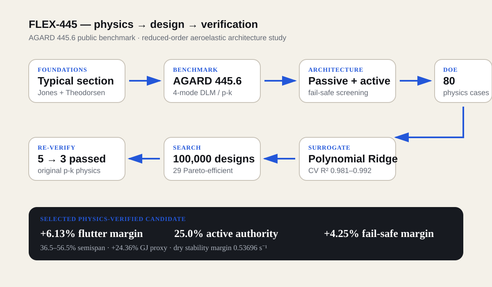
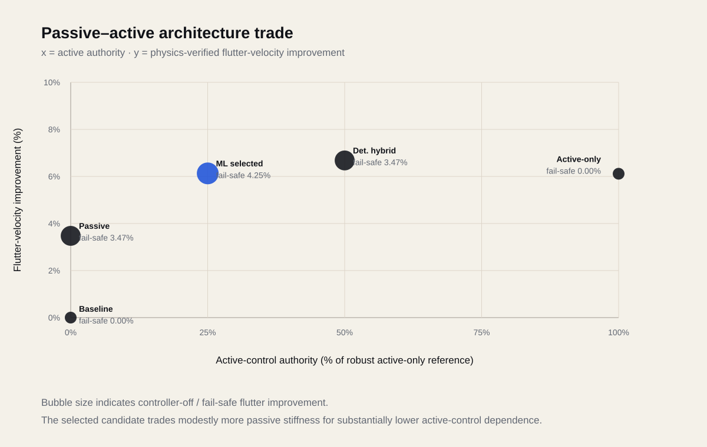
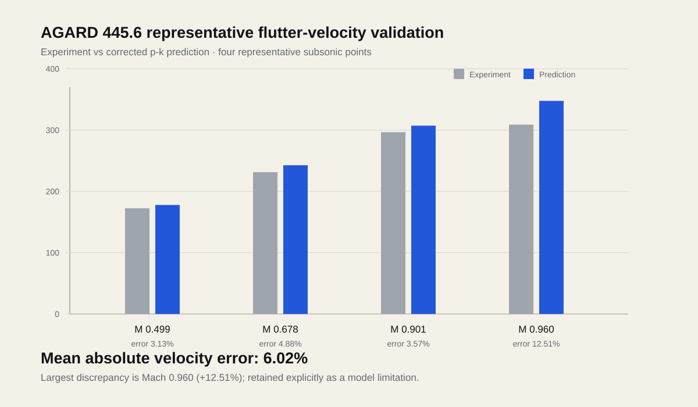

# FLEX-445 — Physics-Guided Hybrid Flutter Mitigation on the AGARD 445.6 Benchmark

**Public benchmark · unsteady aerodynamics · p-k flutter · passive tailoring · active control · fail-safe design · surrogate-assisted optimization · Siemens NX concept integration**

FLEX-445 is an independent reduced-order aeroelastic design study built on the public **AGARD 445.6 weakened Model 3** benchmark. The project asks a practical systems question:

> Can a flexible wing gain flutter margin without relying entirely on structural mass or entirely on active control?

The workflow begins with a transparent 2-DOF typical-section model, progresses to a four-mode Doublet Lattice Method (DLM) benchmark, then explores passive torsional tailoring, active-control bandwidth/delay, hybrid fail-safe architectures, physics-generated design-of-experiments data, ML surrogates, a 100,000-design search, and final re-verification with the original p-k physics model.



## Final project outcome

The selected **minimum-active-authority** design from the surrogate-assisted search was re-run through the original aeroelastic solver and passed the project-level constraints:

| Quantity | Physics-verified result |
|---|---:|
| Reinforcement region | 36.5–56.5% semispan |
| Local torsional-stiffness proxy | +24.362% GJ |
| Notional added mass | 2.436% of baseline panel mass (0.0454 kg) |
| Active authority | 25.011% of robust active-only reference |
| Controller bandwidth | 55.64 Hz |
| Total delay | 6.33 ms |
| Hybrid flutter-velocity improvement | **+6.131%** |
| Controller-off / fail-safe improvement | **+4.248%** |
| Minimum dry closed-loop stability margin | **0.53696 1/s** |
| Noncritical tracked branches at flutter boundary | Stable |

The result is not “AI predicted a better wing.” ML was used only as a fast screening layer. Five shortlisted designs were sent back to the original p-k model; only three passed all physics requirements.




## How the design evolved

FLEX-445 was not a single “optimized wing” calculation. The architecture was modified in stages, and each stage changed what the next design decision meant.

| Stage | Modification | Result | Engineering reason for the next step |
|---|---|---|---|
| Public AGARD 445.6 baseline | Reconstructed the weakened Model-3 benchmark with four structural modes and DLM/p-k aerodynamics | Representative mean absolute flutter-velocity error ≈ 6.02% | Establish a credible public baseline before changing the design |
| Passive-only concept | Added local torsional-stiffness tailoring in the mid-span region | ≈ +3.47% controller-off flutter improvement | Passive tailoring gives useful fail-safe margin, but does not reach the full hybrid target alone |
| Robust active-only concept | Added finite-bandwidth, delayed torsional feedback and rejected dry-unstable controllers | ≈ +6.12% flutter improvement at 100% active-only reference authority | Active control reaches the target but creates full dependence on the controller |
| Deterministic hybrid reference | Combined a 20% GJ proxy with 50% active authority | ≈ +6.68% hybrid improvement and +3.47% controller-off margin | Demonstrated that passive and active mechanisms can share the stability burden |
| Physics DOE + surrogate search | Varied reinforcement position, GJ gain, active authority, bandwidth and delay across 80 converged physics cases; screened 100,000 candidates | 19,217 surrogate-feasible designs, 29 Pareto-efficient, 5 shortlisted | Search the architecture trade space rather than tuning one variable at a time |
| Final physics-verified hybrid | Shifted reinforcement to 36.5–56.5% semispan, increased the GJ proxy to +24.362%, and reduced active authority to 25.011% | **+6.131% hybrid improvement, +4.248% controller-off improvement, 0.53696 s⁻¹ dry margin** | Final architecture prioritizes lower controller dependence while preserving the target flutter gain |

The key improvement is therefore **system-level**, not simply the largest possible flutter-speed increase. Compared with the robust active-only architecture, the selected hybrid reaches essentially the same total flutter improvement while using about one quarter of the active-control authority and retaining a passive margin if the controller is removed. Compared with the deterministic 50%-authority hybrid reference, it sacrifices some peak hybrid gain in exchange for much lower active dependence and a larger fail-safe margin.


## Benchmark credibility

The wing-level model uses public geometry, modal data and measured flutter points from **NASA TM-100492**. The corrected representative validation gave a mean absolute flutter-velocity error of **6.023%** and a mean absolute flutter-frequency error of **6.766%** across Mach 0.499, 0.678, 0.901 and 0.960. The Mach 0.960 point remains the largest velocity discrepancy (+12.513%), and this limitation is carried explicitly into the project conclusions.



## Engineering decision chain

1. **Typical-section foundations** — coupled structural dynamics, static divergence, Wagner/Jones state-space aerodynamics and Theodorsen frequency-domain flutter.
2. **AGARD structural benchmark** — public Model-3 geometry, measured modal frequencies and tabulated modal fields.
3. **DLM aerodynamic model** — PanelAero DLM/VLM implementation, mesh-convergence study and generalized aerodynamic matrices.
4. **p-k flutter solver** — reduced-frequency consistency plus MAC-based branch tracking.
5. **Wall/spline audits** — explicit wall-image aerodynamics and smooth structural-to-aerodynamic transfer.
6. **Passive tailoring** — location and mechanism studies showed torsional stiffness was the dominant passive mechanism.
7. **Active control** — controller bandwidth and delay were included; controllers that improved aeroelastic margin but failed dry closed-loop checks were rejected.
8. **Hybrid architecture** — passive margin was retained if active control was lost.
9. **Physics DOE + ML** — 80/80 DOE cases converged; Polynomial Ridge surrogates achieved cross-validated R² of 0.981–0.992 for the three key outputs.
10. **100,000-design screening** — 19,217 surrogate-feasible designs, 29 Pareto-efficient designs, five selected for physics re-verification.
11. **Physics re-verification** — three of five shortlisted designs passed every final requirement.
12. **Siemens NX concept integration** — the benchmark wing, nominal reinforcement region and actuator packaging envelope were mapped into a concept-level CAD model.

## Repository structure

```text
FLEX445/
├── notebooks/
│   ├── FLEX445_01_Typical_Section.ipynb
│   └── FLEX445_02_AGARD4456_Benchmark.ipynb
├── data/
│   ├── benchmark_validation.csv
│   ├── architecture_comparison.csv
│   └── ml_candidate_verification.csv
├── assets/
│   ├── flex445-architecture.svg
│   ├── flex445-trade.svg
│   └── flex445-validation.svg
├── cad/
│   └── README.md
├── REFERENCES.md
├── MODEL_LIMITATIONS.md
├── THIRD_PARTY_NOTICES.md
├── CITATION.cff
├── requirements.txt
└── LICENSE
```

The repository notebooks are intentionally **output-cleared** so GitHub can render them quickly. The key numerical results are preserved in `data/`.

## Reproducibility

Python dependencies are listed in `requirements.txt`. The DLM implementation used **PanelAero 2025.8**. The notebooks were developed interactively in Google Colab/Jupyter-style environments.

```bash
pip install -r requirements.txt
```

Run Notebook 01 first. Notebook 02 is the full AGARD benchmark and design study and is intentionally much larger computationally.

## What is original vs sourced

**Original project work:** computational implementation, verification checks, coupling studies, passive/active/hybrid architecture studies, DOE design, surrogate training, design-space screening, Pareto selection, physics re-verification, plots, conclusions and Siemens NX concept geometry.

**Public source data:** AGARD 445.6 geometry/modal/flutter data transcribed from NASA TM-100492; classical unsteady-aerodynamic theory from Theodorsen/Jones sources; PanelAero is an external open-source dependency.

See [REFERENCES.md](REFERENCES.md) and [THIRD_PARTY_NOTICES.md](THIRD_PARTY_NOTICES.md) for attribution and reuse notes.

## Scope and claim boundary

FLEX-445 is a **reduced-order public-benchmark research/portfolio study**. It does **not** establish certification compliance, flight flutter clearance, OEM loads, detailed composite sizing, nonlinear transonic CFD, actuator thermal/reliability qualification, sensor architecture, fatigue/durability, or production-ready hardware. The GJ–mass relation used in the hybrid design search is a notional design-study proxy. The NX model is a concept-level packaging visualization, not an independent structural validation.

See [MODEL_LIMITATIONS.md](MODEL_LIMITATIONS.md) for the full claim boundary.
